# DevOps-Automate
## About Project

This project is about the automation of the things which takes place in the industries. This is the small infrastructure that are build in the industries. The DevOps tools such as Git, GitHub, Jenkins, Docker are used in this project.

## Working of the Project:

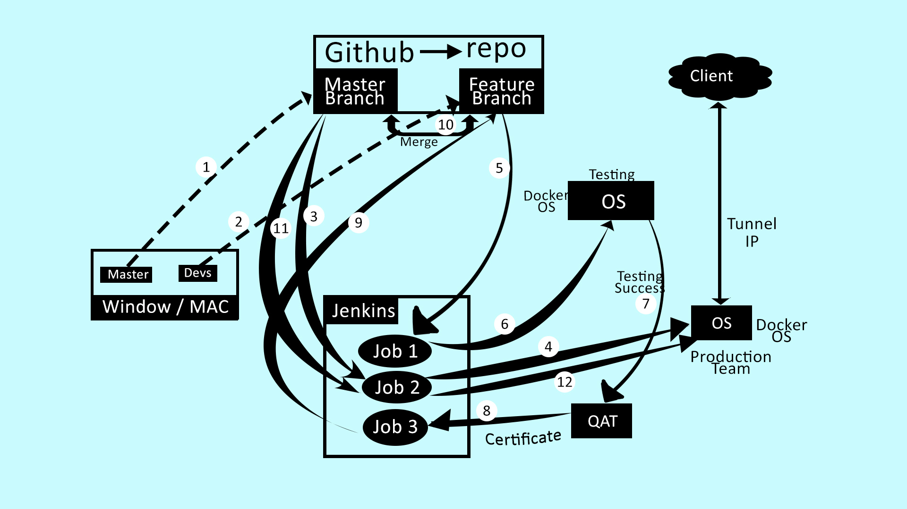

### Step 1: In this we have created the git repo of master branch and after commit it will directly push to the GitHub.

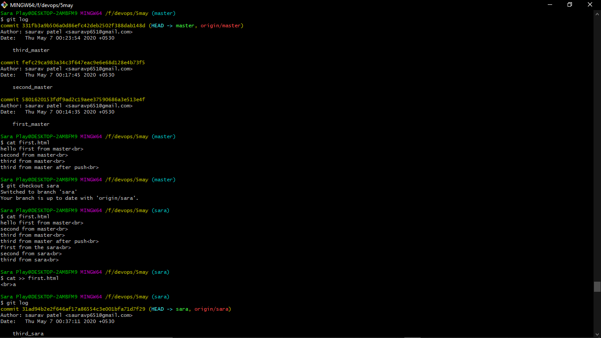

### Step 2: In this we have created the git repo of feature branch (in this project namely sara) and after commit it will directly push to the GitHub.

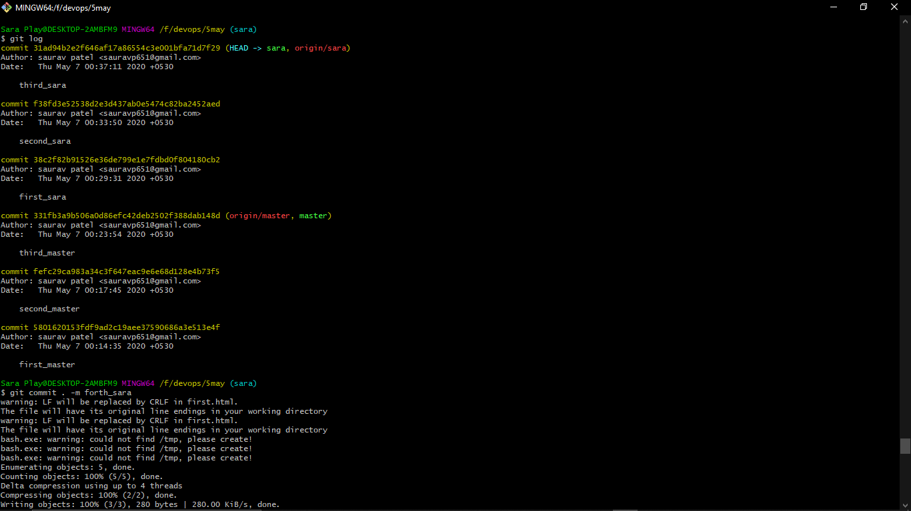

### Step 3: Now the master branch code will go to the Jenkins and it will trigger the job 2.

### Step 4: Now the triggered job will do its work. It will copy the data to the folder in the host os and then  the code is send to the production system os by mounting the folder where webserver is running in the docker os, which is triggered by this job as it is the down-stream of this job and clients can connect through the IP.

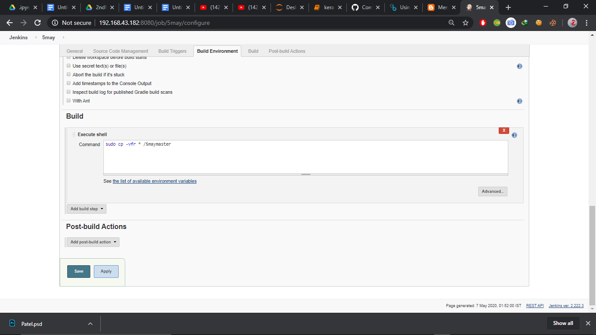

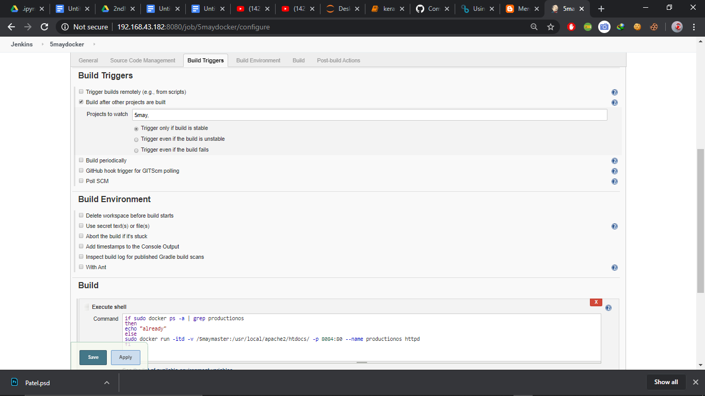

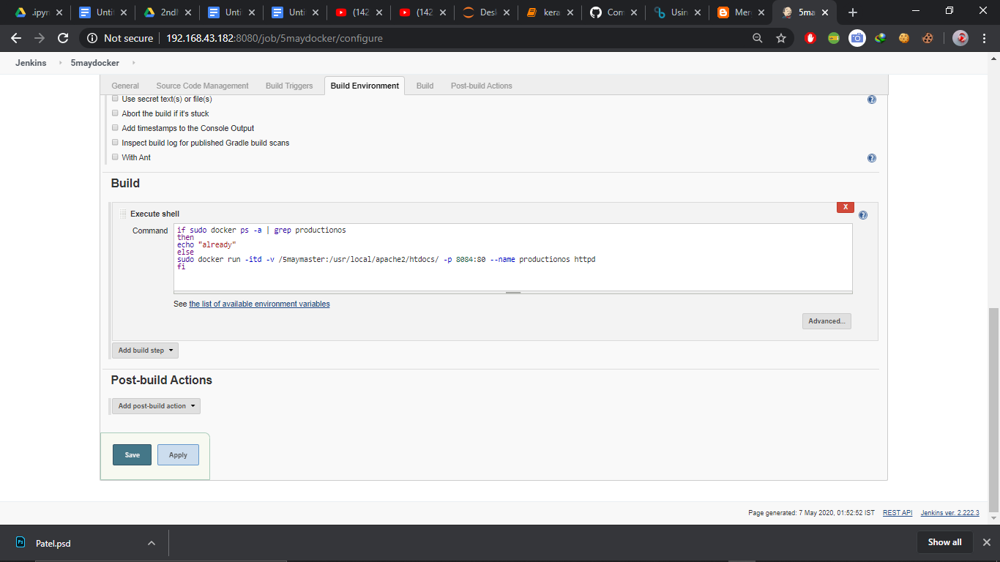

### Step 5: It will also go to the job 1 when there is any commit in the feature branch and triggered the job 1.

### Step 6: The job 1 will now run the job where it will copy the data into the folder and launch the testing os with the mounting of that folder and this is used by the testing team to test the code.

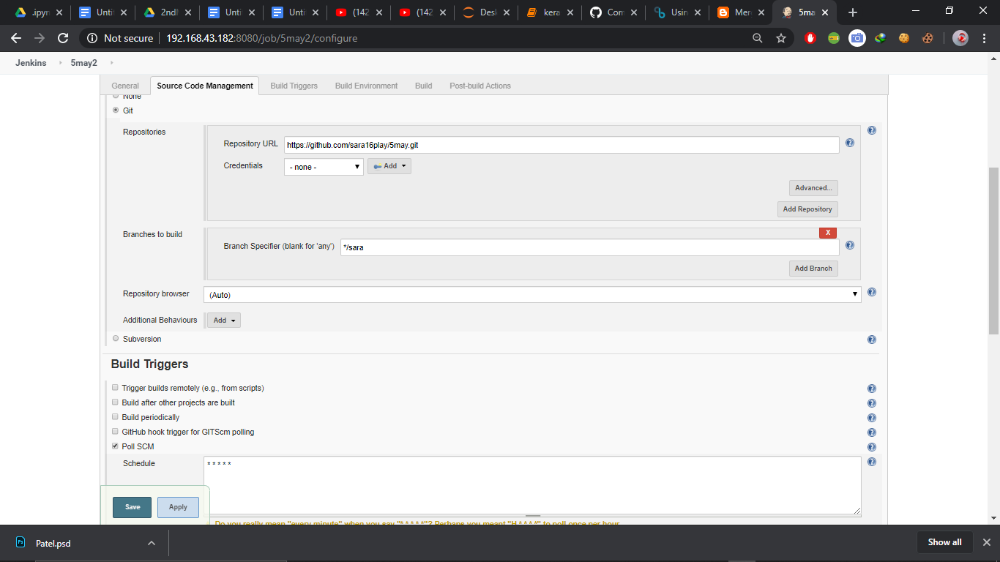

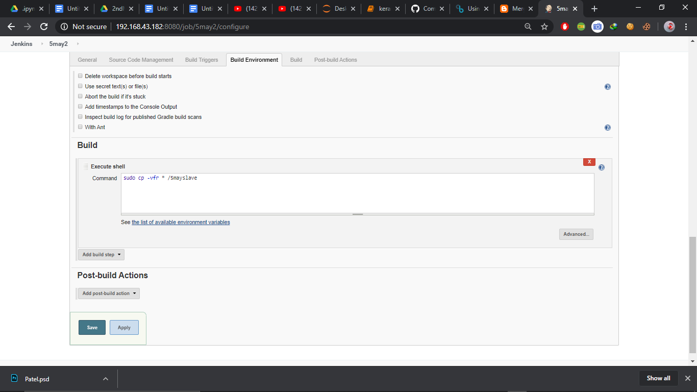

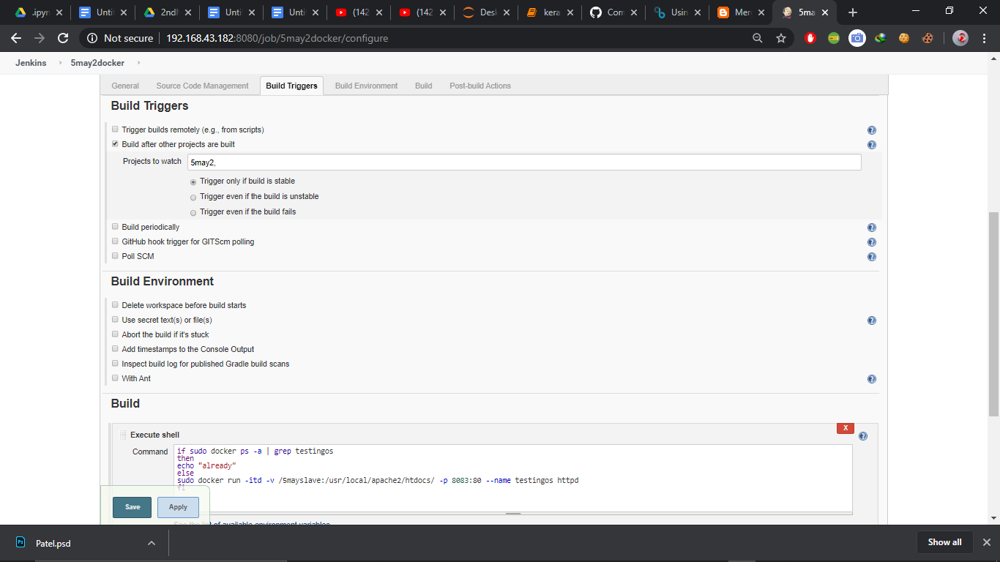

### Step 7 & 8: Now the quality assurance team (QAT) will check that code that it is working well or not and if it is ok then they will give the certificate and the job 3 will get triggered.

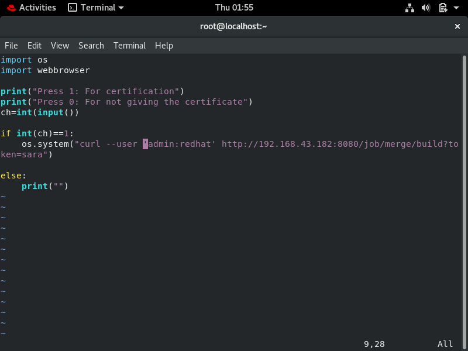

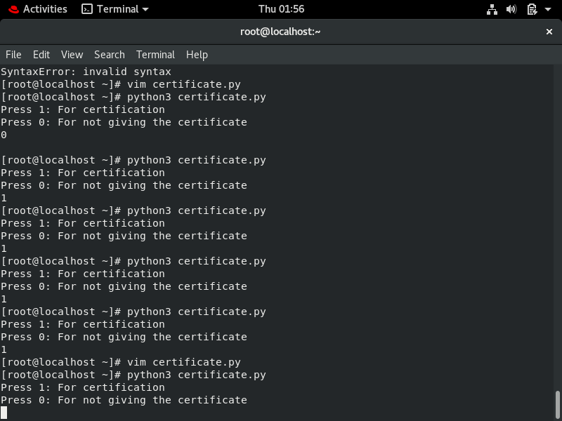

### Step 8, 9 & 10: In job 3 as the testing team have given the certificate then it will go to the GitHub & merge the code with the master branch code and also delete the testing os as we always want new os for testing that’s why we use Docker.

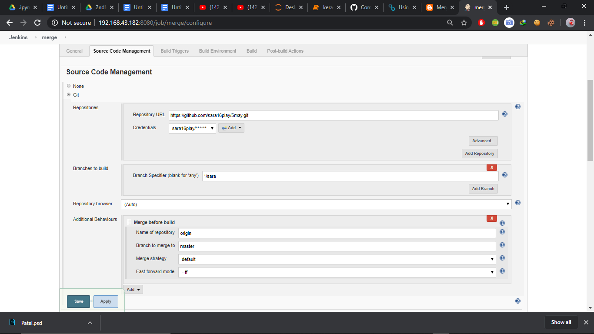

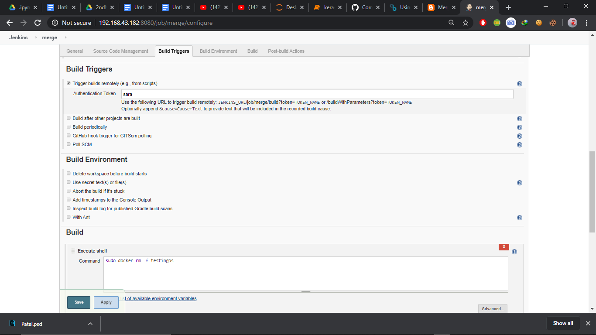

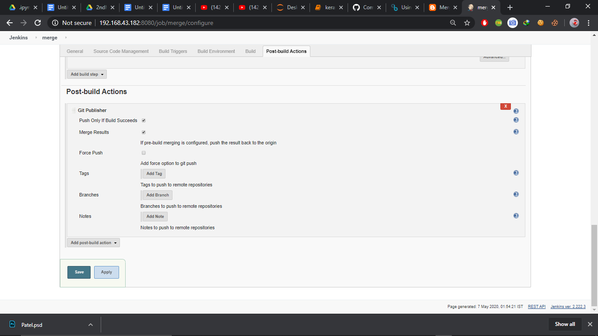

### Step 11: Now if the master branch gets another commit or new commit then it will trigger the job 2 again.

### Step 12: Now again the job 2 will send the code to the production os where the webserver is running and then the client will now able to the updated code.

## All Jobs:
* 5may & 5maydocker (Job 2, according to my project & working diagram, you can name according to your choice)
* 5may2 & 5may2docker (Job 1, according to my project & working diagram, you can name according to your choice)
* merge (Job 3, according to my project & working diagram, you can name according to your choice)

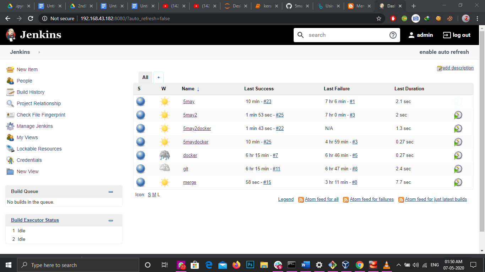

## In this all the things are automated with the help of the Jenkins. 

## Author

[SAURAV PATEL](https://www.linkedin.com/in/saurav-patel-148539151/)
